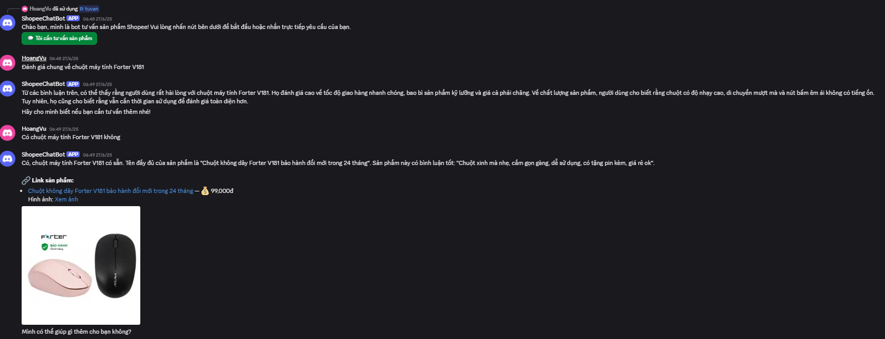

# Shopee Product Recommendation Chatbot

Một chatbot thông minh hỗ trợ tư vấn sản phẩm trên Shopee, sử dụng LangGraph và Discord để tạo trải nghiệm tư vấn mua sắm tự nhiên và hiệu quả.



## Tính năng chính

- **Tư vấn thông minh**: Phân tích và hiểu yêu cầu của người dùng dựa trên ngữ cảnh
- **Tìm kiếm sản phẩm**: Hỗ trợ tìm kiếm theo tên hoặc đặc điểm sản phẩm
- **So sánh sản phẩm**: Phân tích và so sánh các sản phẩm dựa trên đánh giá thực tế
- **Gợi ý sản phẩm**: Đề xuất sản phẩm phù hợp dựa trên yêu cầu người dùng
- **Tích hợp Discord**: Tương tác thông qua Discord bot với giao diện thân thiện
- **Lưu trữ ngữ cảnh**: Ghi nhớ và sử dụng thông tin từ các cuộc hội thoại trước

## Công nghệ sử dụng

- **LangGraph**: Xử lý luồng hội thoại và logic tư vấn
- **Qdrant**: Vector database cho tìm kiếm ngữ nghĩa
- **Discord.py**: Tích hợp với nền tảng Discord
- **HuggingFace**: Mô hình embedding đa ngôn ngữ
- **Groq**: LLM cho xử lý ngôn ngữ tự nhiên

## Cấu trúc dự án

```
main/
├── chatbot_langgraph.py    # Entry point của chatbot
├── config.py               # Cấu hình và thiết lập
├── discord_bot.py          # Bot Discord và xử lý tương tác
├── utils.py               # Các hàm tiện ích
└── graph/                 # Module xử lý logic chatbot
    ├── __init__.py
    ├── builder.py        # Xây dựng luồng xử lý
    ├── nodes.py         # Các node xử lý chính
    └── state.py         # Định nghĩa trạng thái
```

## Các chức năng chính

### 1. Phân tích ý định người dùng
- Xác định loại sản phẩm, tính năng mong muốn
- Phát hiện yêu cầu về giá, chất liệu
- Phân loại loại câu hỏi (tìm kiếm, so sánh, gợi ý)

### 2. Tìm kiếm và đề xuất
- Tìm kiếm vector similarity với Qdrant
- Sắp xếp và lọc kết quả theo độ phù hợp
- Đề xuất sản phẩm dựa trên đánh giá thực

### 3. So sánh sản phẩm
- So sánh chi tiết các đặc điểm
- Phân tích ưu, nhược điểm
- Đề xuất lựa chọn phù hợp

### 4. Tương tác Discord
- Giao diện nút bấm thân thiện
- Hiển thị thông tin sản phẩm dưới dạng embed
- Hỗ trợ tin nhắn dài và hình ảnh

## Cài đặt

1. Cài đặt các thư viện cần thiết:
```bash
pip install -r requirements.txt
```

2. Cấu hình các biến môi trường trong `config.py`:
- QDRANT_HOST và QDRANT_PORT
- GROQ_API_KEY
- Discord Token trong `discord_bot.py`

3. Khởi chạy Qdrant server

4. Chạy bot:
```bash
python discord_bot.py
```

## Cách sử dụng

1. Thêm bot vào server Discord
2. Sử dụng lệnh `/tuvan` để bắt đầu
3. Nhấn nút "Tôi cần tư vấn sản phẩm"
4. Đặt câu hỏi trực tiếp với bot

Ví dụ câu hỏi:
- "Gợi ý tai nghe không dây dưới 500k"
- "So sánh chuột gaming A và B"
- "Tìm ốp lưng silicon cho iPhone 15"
